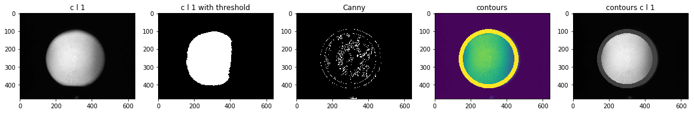
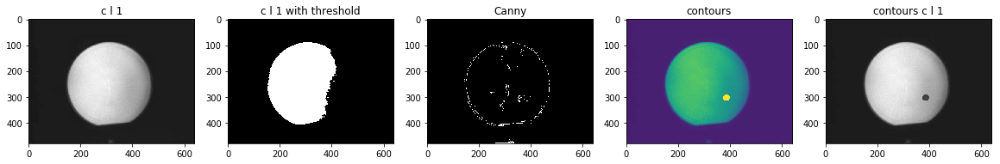
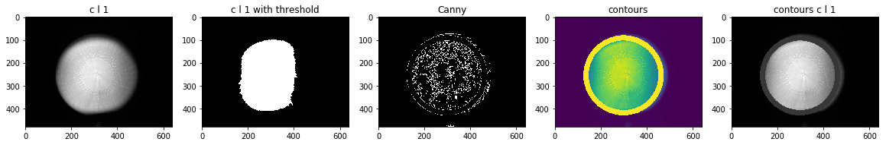
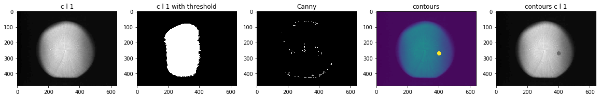
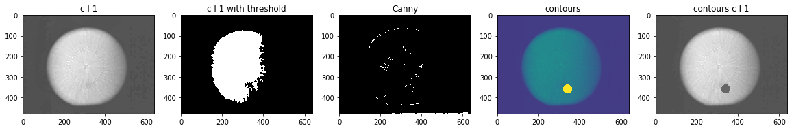
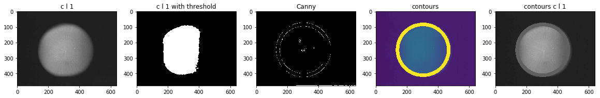
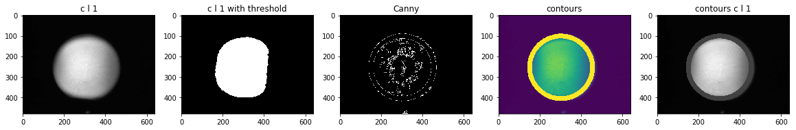
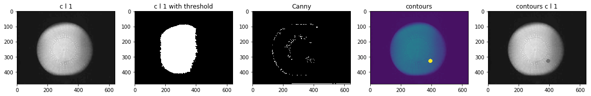
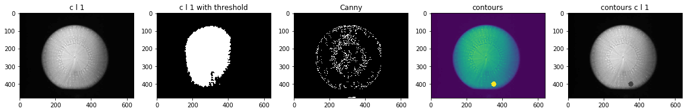

```python
# find the outlines
# draw a white circle arounds it
from matplotlib.pyplot import imshow
import numpy as np
from PIL import Image
from PIL import Image
import cv2
import matplotlib.pyplot as plt
import numpy as np
import sys 
import random    
import glob
%matplotlib inline 
```


```python
# find the outlines
# draw a white circle arounds it
import cv2
import numpy as np
from matplotlib.pyplot import imshow
import matplotlib.pyplot as plt

path = r'S:\QA\Magic Mirror data\30micron OKMETIC nozzle-6 inches'
files = glob.glob(path + "/**/*.jpg", recursive=True)

kernel = cv2.getStructuringElement(cv2.MORPH_CROSS,(3,3))

for i in range(100):
    plt.figure(figsize=(20,10)) 
    name1 = files[random.randint(0, len(files)-1)]
    img = cv2.imread(name1, 0)  
    img1 = cv2.imread(name1, 0)  
#     img1 = cv2.bitwise_not(img1)
    quartiles = np.percentile(img, range(0, 100, 10), interpolation = 'midpoint')
    print(quartiles)
# img = cv2.adaptiveThreshold(img,255,cv2.ADAPTIVE_THRESH_MEAN_C,\
#             cv2.THRESH_BINARY,11,2)

    clahe = cv2.createCLAHE(clipLimit=0.05, tileGridSize=(8,8))
    cl1 = clahe.apply(img)
    
    quartiles = np.percentile(cl1, range(0, 100, 10), interpolation = 'midpoint')
    print(quartiles)
    plt.subplot(1,5,1), plt.imshow(cl1, cmap='gray'), plt.title("c l 1") 
    
    ret,cl1 = cv2.threshold(cl1,quartiles[-2],255,cv2.THRESH_BINARY)
    dilation = cv2.dilate(cl1,kernel,iterations = 4)
    erosion = cv2.erode(dilation,kernel,iterations = 3)
    cl1 = erosion
    dilation = cv2.dilate(cl1,kernel,iterations = 4)
    erosion = cv2.erode(dilation,kernel,iterations = 3)
    cl1 = erosion
    
    quartiles = np.percentile(cl1, range(0, 100, 10), interpolation = 'midpoint')
    print(quartiles)
    plt.subplot(1,5,2), plt.imshow(cl1, cmap='gray') , plt.title("c l 1 with threshold")
    
    contours,hierarchy = cv2.findContours(cl1, 0 , 2 ) 
    cnt = contours[0]
    M = cv2.moments(cnt)
    print(M)
    (x,y),radius = cv2.minEnclosingCircle(cnt)
    center = (int(x),int(y))
    radius = int(radius)
    con = cv2.circle(img,center,radius, 255, 22)
    print(center, radius, "ordinary")
    plt.subplot(1,5,4), plt.imshow(con ), plt.title("contours")
    
    ret,thresh = cv2.threshold(cl1,11,255,3)
    contours1,hierarchy = cv2.findContours(cl1, 0 , 2 ) 
    cnt1 = contours1[0]
    M = cv2.moments(cnt1)
    print(M)
    (x,y),radius = cv2.minEnclosingCircle(cnt1)
    center = (int(x),int(y))
    radius = int(radius)
    con1 = cv2.circle(img,center,radius, 55, 22)
    print(center, radius, "cl1-ed")
    plt.subplot(1,5,5), plt.imshow(con1, cmap='gray' ), plt.title("contours c l 1")

    edged = cv2.Canny(img, 11, 60)
    plt.subplot(1,5,3), plt.imshow(edged, cmap='gray'), plt.title("Canny")
    plt.show() 
    if input("Press Enter to continue...") == "0":
        break

```

    [ 0.  0.  0.  0.  0.  0. 38. 64. 75. 84.]
    [ 1.  1.  1.  1.  1.  1. 41. 67. 78. 88.]
    [  0.   0.   0.   0.   0.   0.   0.   0. 255. 255.]
    {'m00': 222.5, 'm10': 68074.83333333333, 'm01': 95568.66666666666, 'm20': 20830682.416666664, 'm11': 29242065.458333332, 'm02': 41063359.916666664, 'm30': 6375010405.25, 'm21': 8948717310.5, 'm12': 12565587066.0, 'm03': 17650112085.5, 'mu20': 2893.9521223455667, 'mu11': 2420.26632335037, 'mu02': 14505.766354560852, 'mu30': 2565.4702825546265, 'mu21': -2072.739458678523, 'mu12': -3880.897820590064, 'mu03': 30514.31687927246, 'nu20': 0.05845629839354763, 'nu11': 0.04888809641914648, 'nu02': 0.2930087888814211, 'nu30': 0.003474097078714145, 'nu21': -0.002806853054310235, 'nu12': -0.005255416861767117, 'nu03': 0.04132174122230586}
    (306, 429) 15 ordinary
    {'m00': 222.5, 'm10': 68074.83333333333, 'm01': 95568.66666666666, 'm20': 20830682.416666664, 'm11': 29242065.458333332, 'm02': 41063359.916666664, 'm30': 6375010405.25, 'm21': 8948717310.5, 'm12': 12565587066.0, 'm03': 17650112085.5, 'mu20': 2893.9521223455667, 'mu11': 2420.26632335037, 'mu02': 14505.766354560852, 'mu30': 2565.4702825546265, 'mu21': -2072.739458678523, 'mu12': -3880.897820590064, 'mu03': 30514.31687927246, 'nu20': 0.05845629839354763, 'nu11': 0.04888809641914648, 'nu02': 0.2930087888814211, 'nu30': 0.003474097078714145, 'nu21': -0.002806853054310235, 'nu12': -0.005255416861767117, 'nu03': 0.04132174122230586}
    (306, 429) 15 cl1-ed
    


    Press Enter to continue...
    [  0.   2.   2.   4.   4.   4.   4.   6. 129. 184.]
    [  1.   3.   3.   5.   5.   5.   5.   7. 131. 186.]
    [  0.   0.   0.   0.   0.   0.   0.   0. 255. 255.]
    {'m00': 62987.0, 'm10': 17871286.166666664, 'm01': 16189765.333333332, 'm20': 5346986710.333333, 'm11': 4597812846.0, 'm02': 4527111049.5, 'm30': 1672946152962.75, 'm21': 1376962605914.85, 'm12': 1288429047295.4167, 'm03': 1351522952578.8, 'mu20': 276371039.62522984, 'mu11': 4294671.7230939865, 'mu02': 365799960.7292743, 'mu30': -982459360.0134277, 'mu21': 171161720.6635437, 'mu12': 1745183503.613144, 'mu03': -141622264.33203125, 'nu20': 0.06966115717509373, 'nu11': 0.001082500548261387, 'nu02': 0.09220231104373224, 'nu30': -0.0009867048998788521, 'nu21': 0.00017190136846790863, 'nu12': 0.0017527250330021758, 'nu03': -0.00014223426213420506}
    (295, 255) 152 ordinary
    {'m00': 62987.0, 'm10': 17871286.166666664, 'm01': 16189765.333333332, 'm20': 5346986710.333333, 'm11': 4597812846.0, 'm02': 4527111049.5, 'm30': 1672946152962.75, 'm21': 1376962605914.85, 'm12': 1288429047295.4167, 'm03': 1351522952578.8, 'mu20': 276371039.62522984, 'mu11': 4294671.7230939865, 'mu02': 365799960.7292743, 'mu30': -982459360.0134277, 'mu21': 171161720.6635437, 'mu12': 1745183503.613144, 'mu03': -141622264.33203125, 'nu20': 0.06966115717509373, 'nu11': 0.001082500548261387, 'nu02': 0.09220231104373224, 'nu30': -0.0009867048998788521, 'nu21': 0.00017190136846790863, 'nu12': 0.0017527250330021758, 'nu03': -0.00014223426213420506}
    (295, 255) 152 cl1-ed
    


    Press Enter to continue...
    [ 1. 18. 20. 20. 20. 20. 20. 37. 70. 84.]
    [ 2. 19. 21. 21. 21. 21. 22. 38. 73. 87.]
    [  0.   0.   0.   0.   0.   0.   0.   0. 255. 255.]
    {'m00': 62689.5, 'm10': 18006473.333333332, 'm01': 16156930.166666666, 'm20': 5413996970.083333, 'm11': 4617373230.541666, 'm02': 4585889602.916666, 'm30': 1692837105845.9001, 'm21': 1381955683383.6, 'm12': 1308232043782.4666, 'm03': 1398717603669.05, 'mu20': 241949308.12966633, 'mu11': -23425183.77990532, 'mu02': 421772926.1120448, 'mu30': -1231272403.4648438, 'mu21': 66195127.054000854, 'mu12': 3089384683.5266724, 'mu03': -607793616.5117188, 'nu20': 0.061565125987525456, 'nu11': -0.00596064688855367, 'nu02': 0.10732208136879334, 'nu30': -0.0012513163832274167, 'nu21': 6.727272270490445e-05, 'nu12': 0.003139677018432544, 'nu03': -0.0006176879363347731}
    (297, 253) 163 ordinary
    {'m00': 62689.5, 'm10': 18006473.333333332, 'm01': 16156930.166666666, 'm20': 5413996970.083333, 'm11': 4617373230.541666, 'm02': 4585889602.916666, 'm30': 1692837105845.9001, 'm21': 1381955683383.6, 'm12': 1308232043782.4666, 'm03': 1398717603669.05, 'mu20': 241949308.12966633, 'mu11': -23425183.77990532, 'mu02': 421772926.1120448, 'mu30': -1231272403.4648438, 'mu21': 66195127.054000854, 'mu12': 3089384683.5266724, 'mu03': -607793616.5117188, 'nu20': 0.061565125987525456, 'nu11': -0.00596064688855367, 'nu02': 0.10732208136879334, 'nu30': -0.0012513163832274167, 'nu21': 6.727272270490445e-05, 'nu12': 0.003139677018432544, 'nu03': -0.0006176879363347731}
    (297, 253) 163 cl1-ed
    


    Press Enter to continue...
    [  0.   4.   4.   4.   4.   4.   6.  84. 130. 153.]
    [  1.   5.   5.   5.   5.   5.   7.  86. 133. 155.]
    [  0.   0.   0.   0.   0.   0.   0.   0. 255. 255.]
    {'m00': 23.0, 'm10': 7636.0, 'm01': 9346.666666666666, 'm20': 2535196.833333333, 'm11': 3103093.333333333, 'm02': 3798310.1666666665, 'm30': 841715118.0, 'm21': 1030245210.9666667, 'm12': 1261038975.3333333, 'm03': 1543578951.4, 'mu20': 44.83333333302289, 'mu11': 0.0, 'mu02': 41.567632850725204, 'mu30': 3.5762786865234375e-07, 'mu21': 5.072947176795424, 'mu12': -1.0989606380462646e-07, 'mu03': -7.820051908493042, 'nu20': 0.08475110270892795, 'nu11': 0.0, 'nu02': 0.07857775586148431, 'nu30': 1.4096515214087705e-10, 'nu21': 0.0019995890512513976, 'nu12': -4.331741654329034e-11, 'nu03': -0.0030824074510308807}
    (332, 406) 3 ordinary
    {'m00': 23.0, 'm10': 7636.0, 'm01': 9346.666666666666, 'm20': 2535196.833333333, 'm11': 3103093.333333333, 'm02': 3798310.1666666665, 'm30': 841715118.0, 'm21': 1030245210.9666667, 'm12': 1261038975.3333333, 'm03': 1543578951.4, 'mu20': 44.83333333302289, 'mu11': 0.0, 'mu02': 41.567632850725204, 'mu30': 3.5762786865234375e-07, 'mu21': 5.072947176795424, 'mu12': -1.0989606380462646e-07, 'mu03': -7.820051908493042, 'nu20': 0.08475110270892795, 'nu11': 0.0, 'nu02': 0.07857775586148431, 'nu30': 1.4096515214087705e-10, 'nu21': 0.0019995890512513976, 'nu12': -4.331741654329034e-11, 'nu03': -0.0030824074510308807}
    (332, 406) 3 cl1-ed
    


    Press Enter to continue...
    [  0.   2.   4.   4.   4.   4.   4.   6. 125. 174.]
    [  1.   3.   5.   5.   5.   5.   5.   7. 127. 175.]
    [  0.   0.   0.   0.   0.   0.   0.   0. 255. 255.]
    {'m00': 62967.0, 'm10': 18073330.833333332, 'm01': 16014962.5, 'm20': 5450138650.333333, 'm11': 4581052606.666666, 'm02': 4460794327.666666, 'm30': 1713995562956.35, 'm21': 1376675352741.2, 'm12': 1274616966078.5332, 'm03': 1332252376415.85, 'mu20': 262575523.43960667, 'mu11': -15699907.283927917, 'mu02': 387565114.3262458, 'mu30': -1083566154.6206055, 'mu21': -494702495.6503601, 'mu12': 2227542879.6318207, 'mu03': 552669866.6982422, 'nu20': 0.06622595586899571, 'nu11': -0.003959780231274599, 'nu02': 0.09775042936793653, 'nu30': -0.0010891129590988222, 'nu21': -0.0004972348911174548, 'nu12': 0.00223894573193343, 'nu03': 0.0005554989987069386}
    (298, 255) 154 ordinary
    {'m00': 62967.0, 'm10': 18073330.833333332, 'm01': 16014962.5, 'm20': 5450138650.333333, 'm11': 4581052606.666666, 'm02': 4460794327.666666, 'm30': 1713995562956.35, 'm21': 1376675352741.2, 'm12': 1274616966078.5332, 'm03': 1332252376415.85, 'mu20': 262575523.43960667, 'mu11': -15699907.283927917, 'mu02': 387565114.3262458, 'mu30': -1083566154.6206055, 'mu21': -494702495.6503601, 'mu12': 2227542879.6318207, 'mu03': 552669866.6982422, 'nu20': 0.06622595586899571, 'nu11': -0.003959780231274599, 'nu02': 0.09775042936793653, 'nu30': -0.0010891129590988222, 'nu21': -0.0004972348911174548, 'nu12': 0.00223894573193343, 'nu03': 0.0005554989987069386}
    (298, 255) 154 cl1-ed
    





    Press Enter to continue...
    [  4.  26.  26.  26.  26.  26.  26.  28. 140. 172.]
    [  5.  27.  27.  27.  27.  27.  27.  29. 143. 174.]
    [  0.   0.   0.   0.   0.   0.   0.   0. 255. 255.]
    {'m00': 12.0, 'm10': 4614.0, 'm01': 3636.0, 'm20': 1774096.0, 'm11': 1398042.0, 'm02': 1101718.6666666665, 'm30': 682149909.0, 'm21': 537551088.0, 'm12': 423610827.3333333, 'm03': 333827220.0, 'mu20': 13.0, 'mu11': 0.0, 'mu02': 10.666666666511446, 'mu30': 0.0, 'mu21': 0.0, 'mu12': 3.9814040064811707e-08, 'mu03': 1.1920928955078125e-07, 'nu20': 0.09027777777777778, 'nu11': 0.0, 'nu02': 0.07407407407299615, 'nu30': 0.0, 'nu21': 0.0, 'nu12': 7.981474565606105e-11, 'nu03': 2.389774840696097e-10}
    (384, 303) 2 ordinary
    {'m00': 12.0, 'm10': 4614.0, 'm01': 3636.0, 'm20': 1774096.0, 'm11': 1398042.0, 'm02': 1101718.6666666665, 'm30': 682149909.0, 'm21': 537551088.0, 'm12': 423610827.3333333, 'm03': 333827220.0, 'mu20': 13.0, 'mu11': 0.0, 'mu02': 10.666666666511446, 'mu30': 0.0, 'mu21': 0.0, 'mu12': 3.9814040064811707e-08, 'mu03': 1.1920928955078125e-07, 'nu20': 0.09027777777777778, 'nu11': 0.0, 'nu02': 0.07407407407299615, 'nu30': 0.0, 'nu21': 0.0, 'nu12': 7.981474565606105e-11, 'nu03': 2.389774840696097e-10}
    (384, 303) 2 cl1-ed
    





    Press Enter to continue...
    [  0.   0.   0.   0.   0.   2.   2.  56. 154. 198.]
    [  1.   1.   1.   1.   1.   3.   3.  58. 155. 199.]
    [  0.   0.   0.   0.   0.   0.   0.   0. 255. 255.]
    {'m00': 63845.5, 'm10': 18373606.833333332, 'm01': 16297073.833333332, 'm20': 5539909790.583333, 'm11': 4666629354.708333, 'm02': 4587397279.916666, 'm30': 1738940936406.6501, 'm21': 1400385977589.1833, 'm12': 1309554539088.55, 'm03': 1389391388108.55, 'mu20': 252310381.60520077, 'mu11': -23380546.49803543, 'mu02': 427439013.0205178, 'mu30': -568158008.4094238, 'mu21': -263229470.6102829, 'mu12': 1318797737.831894, 'mu03': 207146736.49682617, 'nu20': 0.06189770338714127, 'nu11': -0.005735800972427489, 'nu02': 0.10486089821478463, 'nu30': -0.0005516243154095715, 'nu21': -0.00025556935636183986, 'nu12': 0.0012804200390166384, 'nu03': 0.0002011186589260322}
    (297, 255) 163 ordinary
    {'m00': 63845.5, 'm10': 18373606.833333332, 'm01': 16297073.833333332, 'm20': 5539909790.583333, 'm11': 4666629354.708333, 'm02': 4587397279.916666, 'm30': 1738940936406.6501, 'm21': 1400385977589.1833, 'm12': 1309554539088.55, 'm03': 1389391388108.55, 'mu20': 252310381.60520077, 'mu11': -23380546.49803543, 'mu02': 427439013.0205178, 'mu30': -568158008.4094238, 'mu21': -263229470.6102829, 'mu12': 1318797737.831894, 'mu03': 207146736.49682617, 'nu20': 0.06189770338714127, 'nu11': -0.005735800972427489, 'nu02': 0.10486089821478463, 'nu30': -0.0005516243154095715, 'nu21': -0.00025556935636183986, 'nu12': 0.0012804200390166384, 'nu03': 0.0002011186589260322}
    (297, 255) 163 cl1-ed
    





    Press Enter to continue...
    [  0.   4.   6.   6.   6.   6.   8.  52.  86. 103.]
    [  1.   5.   7.   7.   7.   7.   9.  54.  89. 106.]
    [  0.   0.   0.   0.   0.   0.   0.   0. 255. 255.]
    {'m00': 12.0, 'm10': 4806.0, 'm01': 3252.0, 'm20': 1924816.0, 'm11': 1302426.0, 'm02': 881302.6666666666, 'm30': 770899221.0, 'm21': 521625136.0, 'm12': 352961718.0, 'm03': 238838804.0, 'mu20': 13.0, 'mu11': 0.0, 'mu02': 10.666666666627862, 'mu30': 0.0, 'mu21': 0.0, 'mu12': 1.5541445463895798e-08, 'mu03': 2.9802322387695312e-08, 'nu20': 0.09027777777777778, 'nu11': 0.0, 'nu02': 0.07407407407380459, 'nu30': 0.0, 'nu21': 0.0, 'nu12': 3.115575597977822e-11, 'nu03': 5.974437101740242e-11}
    (400, 271) 2 ordinary
    {'m00': 12.0, 'm10': 4806.0, 'm01': 3252.0, 'm20': 1924816.0, 'm11': 1302426.0, 'm02': 881302.6666666666, 'm30': 770899221.0, 'm21': 521625136.0, 'm12': 352961718.0, 'm03': 238838804.0, 'mu20': 13.0, 'mu11': 0.0, 'mu02': 10.666666666627862, 'mu30': 0.0, 'mu21': 0.0, 'mu12': 1.5541445463895798e-08, 'mu03': 2.9802322387695312e-08, 'nu20': 0.09027777777777778, 'nu11': 0.0, 'nu02': 0.07407407407380459, 'nu30': 0.0, 'nu21': 0.0, 'nu12': 3.115575597977822e-11, 'nu03': 5.974437101740242e-11}
    (400, 271) 2 cl1-ed
    





    Press Enter to continue...
    [  0.  44.  44.  46.  46.  46.  49.  93. 108. 116.]
    [  1.  45.  46.  47.  48.  48.  51.  96. 111. 119.]
    [  0.   0.   0.   0.   0.   0.   0.   0. 255. 255.]
    {'m00': 114.0, 'm10': 38798.33333333333, 'm01': 40781.666666666664, 'm20': 13205506.0, 'm11': 13880566.666666666, 'm02': 14591538.666666666, 'm30': 4495009953.3, 'm21': 4724796266.233334, 'm12': 4966808222.433333, 'm03': 5221720629.700001, 'mu20': 1026.4434697888792, 'mu11': 1086.8664717376232, 'mu02': 2553.262183237821, 'mu30': -1206.4816722869873, 'mu21': -936.1525011874037, 'mu12': 946.2238725037314, 'mu03': 5553.9779262542725, 'nu20': 0.07898149198129263, 'nu11': 0.08363084577851825, 'nu02': 0.19646523416726844, 'nu30': -0.008694780056920185, 'nu21': -0.006746592413733743, 'nu12': 0.006819174004054174, 'nu03': 0.04002598433031449}
    (339, 359) 10 ordinary
    {'m00': 114.0, 'm10': 38798.33333333333, 'm01': 40781.666666666664, 'm20': 13205506.0, 'm11': 13880566.666666666, 'm02': 14591538.666666666, 'm30': 4495009953.3, 'm21': 4724796266.233334, 'm12': 4966808222.433333, 'm03': 5221720629.700001, 'mu20': 1026.4434697888792, 'mu11': 1086.8664717376232, 'mu02': 2553.262183237821, 'mu30': -1206.4816722869873, 'mu21': -936.1525011874037, 'mu12': 946.2238725037314, 'mu03': 5553.9779262542725, 'nu20': 0.07898149198129263, 'nu11': 0.08363084577851825, 'nu02': 0.19646523416726844, 'nu30': -0.008694780056920185, 'nu21': -0.006746592413733743, 'nu12': 0.006819174004054174, 'nu03': 0.04002598433031449}
    (339, 359) 10 cl1-ed
    





    Press Enter to continue...
    [ 1. 18. 20. 20. 20. 20. 20. 40. 70. 82.]
    [ 2. 19. 21. 21. 21. 21. 21. 43. 73. 85.]
    [  0.   0.   0.   0.   0.   0.   0.   0. 255. 255.]
    {'m00': 63137.0, 'm10': 18220529.0, 'm01': 15698548.333333332, 'm20': 5497953045.166666, 'm11': 4506405696.416666, 'm02': 4339511671.833333, 'm30': 1724020007191.7002, 'm21': 1352090358072.4, 'm12': 1243244410575.7334, 'm03': 1296985609867.7, 'mu20': 239741900.5154953, 'mu11': -23994150.98504162, 'mu02': 436183674.3991389, 'mu30': -991656362.3635254, 'mu21': -1086216143.027069, 'mu12': 2848896304.1371, 'mu03': 1090418254.678711, 'nu20': 0.060141749768327785, 'nu11': -0.006019182384651946, 'nu02': 0.10942121232182049, 'nu30': -0.000990036821122154, 'nu21': -0.0010844421697965814, 'nu12': 0.0028442435784227773, 'nu03': 0.0010886374186947745}
    (302, 248) 164 ordinary
    {'m00': 63137.0, 'm10': 18220529.0, 'm01': 15698548.333333332, 'm20': 5497953045.166666, 'm11': 4506405696.416666, 'm02': 4339511671.833333, 'm30': 1724020007191.7002, 'm21': 1352090358072.4, 'm12': 1243244410575.7334, 'm03': 1296985609867.7, 'mu20': 239741900.5154953, 'mu11': -23994150.98504162, 'mu02': 436183674.3991389, 'mu30': -991656362.3635254, 'mu21': -1086216143.027069, 'mu12': 2848896304.1371, 'mu03': 1090418254.678711, 'nu20': 0.060141749768327785, 'nu11': -0.006019182384651946, 'nu02': 0.10942121232182049, 'nu30': -0.000990036821122154, 'nu21': -0.0010844421697965814, 'nu12': 0.0028442435784227773, 'nu03': 0.0010886374186947745}
    (302, 248) 164 cl1-ed
    





    Press Enter to continue...
    [  0.   2.   4.   4.   4.   4.   4.   6. 104. 163.]
    [  1.   3.   5.   5.   5.   5.   5.   7. 106. 165.]
    [  0.   0.   0.   0.   0.   0.   0.   0. 255. 255.]
    {'m00': 62864.0, 'm10': 18604780.666666664, 'm01': 16034782.333333332, 'm20': 5781558088.333333, 'm11': 4731979026.416666, 'm02': 4456191992.0, 'm30': 1872990536939.6, 'm21': 1466687459367.3667, 'm12': 1313844431498.3667, 'm03': 1323413091344.1, 'mu20': 275420017.9786997, 'mu11': -13560683.900975227, 'mu02': 366184285.2460747, 'mu30': -1100806220.8806152, 'mu21': 6395569.127975464, 'mu12': 1939535366.5605316, 'mu03': -38156474.670166016, 'nu20': 0.06969337227447253, 'nu11': -0.003431449167504607, 'nu02': 0.09266072197660674, 'nu30': -0.0011109789914024476, 'nu21': 6.454671861827534e-06, 'nu12': 0.0019574590009193696, 'nu03': -3.8509086286433226e-05}
    (301, 254) 152 ordinary
    {'m00': 62864.0, 'm10': 18604780.666666664, 'm01': 16034782.333333332, 'm20': 5781558088.333333, 'm11': 4731979026.416666, 'm02': 4456191992.0, 'm30': 1872990536939.6, 'm21': 1466687459367.3667, 'm12': 1313844431498.3667, 'm03': 1323413091344.1, 'mu20': 275420017.9786997, 'mu11': -13560683.900975227, 'mu02': 366184285.2460747, 'mu30': -1100806220.8806152, 'mu21': 6395569.127975464, 'mu12': 1939535366.5605316, 'mu03': -38156474.670166016, 'nu20': 0.06969337227447253, 'nu11': -0.003431449167504607, 'nu02': 0.09266072197660674, 'nu30': -0.0011109789914024476, 'nu21': 6.454671861827534e-06, 'nu12': 0.0019574590009193696, 'nu03': -3.8509086286433226e-05}
    (301, 254) 152 cl1-ed
    





    Press Enter to continue...
    [ 3. 14. 14. 14. 14. 14. 16. 52. 82. 96.]
    [ 4. 15. 15. 15. 15. 15. 17. 54. 85. 99.]
    [  0.   0.   0.   0.   0.   0.   0.   0. 255. 255.]
    {'m00': 8.0, 'm10': 3128.0, 'm01': 2624.0, 'm20': 1223053.3333333333, 'm11': 1025984.0, 'm02': 860677.3333333333, 'm30': 478218024.0, 'm21': 401161493.3333333, 'm12': 336524837.3333333, 'm03': 282305664.0, 'mu20': 5.333333333255723, 'mu11': 0.0, 'mu02': 5.333333333255723, 'mu30': 1.1920928955078125e-07, 'mu21': 5.587935447692871e-09, 'mu12': 1.0477378964424133e-08, 'mu03': 5.960464477539063e-08, 'nu20': 0.08333333333212067, 'nu11': 0.0, 'nu02': 0.08333333333212067, 'nu30': 6.585445079827193e-10, 'nu21': 3.086927381168997e-11, 'nu12': 5.7879888396918686e-11, 'nu03': 3.2927225399135965e-10}
    (391, 328) 2 ordinary
    {'m00': 8.0, 'm10': 3128.0, 'm01': 2624.0, 'm20': 1223053.3333333333, 'm11': 1025984.0, 'm02': 860677.3333333333, 'm30': 478218024.0, 'm21': 401161493.3333333, 'm12': 336524837.3333333, 'm03': 282305664.0, 'mu20': 5.333333333255723, 'mu11': 0.0, 'mu02': 5.333333333255723, 'mu30': 1.1920928955078125e-07, 'mu21': 5.587935447692871e-09, 'mu12': 1.0477378964424133e-08, 'mu03': 5.960464477539063e-08, 'nu20': 0.08333333333212067, 'nu11': 0.0, 'nu02': 0.08333333333212067, 'nu30': 6.585445079827193e-10, 'nu21': 3.086927381168997e-11, 'nu12': 5.7879888396918686e-11, 'nu03': 3.2927225399135965e-10}
    (391, 328) 2 cl1-ed
    





    Press Enter to continue...
    [  0.   4.   4.   4.   4.   4.   6.  89. 130. 155.]
    [  1.   5.   5.   5.   5.   5.   7.  91. 133. 157.]
    [  0.   0.   0.   0.   0.   0.   0.   0. 255. 255.]
    {'m00': 19.5, 'm10': 6837.833333333333, 'm01': 7815.166666666666, 'm20': 2397769.9166666665, 'm11': 2740456.375, 'm02': 3132179.9166666665, 'm30': 840817219.95, 'm21': 960976212.85, 'm12': 1098328111.8166666, 'm03': 1255335993.55, 'mu20': 28.137464387807995, 'mu11': 4.726851852610707, 'mu02': 34.787037037778646, 'mu30': -3.6618478298187256, 'mu21': -0.9920390692732326, 'mu12': 2.973044786876926, 'mu03': 3.2053494453430176, 'nu20': 0.07399727649653647, 'nu11': 0.012430905595294429, 'nu02': 0.09148464704215291, 'nu30': -0.0021807895859229302, 'nu21': -0.0005908023958512878, 'nu12': 0.0017705774273052241, 'nu03': 0.001908924951147938}
    (350, 401) 3 ordinary
    {'m00': 19.5, 'm10': 6837.833333333333, 'm01': 7815.166666666666, 'm20': 2397769.9166666665, 'm11': 2740456.375, 'm02': 3132179.9166666665, 'm30': 840817219.95, 'm21': 960976212.85, 'm12': 1098328111.8166666, 'm03': 1255335993.55, 'mu20': 28.137464387807995, 'mu11': 4.726851852610707, 'mu02': 34.787037037778646, 'mu30': -3.6618478298187256, 'mu21': -0.9920390692732326, 'mu12': 2.973044786876926, 'mu03': 3.2053494453430176, 'nu20': 0.07399727649653647, 'nu11': 0.012430905595294429, 'nu02': 0.09148464704215291, 'nu30': -0.0021807895859229302, 'nu21': -0.0005908023958512878, 'nu12': 0.0017705774273052241, 'nu03': 0.001908924951147938}
    (350, 401) 3 cl1-ed
    





```python

```


```python
# find the outlines
# draw a white circle arounds it

import cv2
import numpy as np
from matplotlib.pyplot import imshow
import matplotlib.pyplot as plt

path = r'S:\QA\Magic Mirror data\30micron OKMETIC nozzle-6 inches'
files = glob.glob(path + "/**/*.jpg", recursive=True)

kernel = cv2.getStructuringElement(cv2.MORPH_CROSS,(3,3))

for i in range(100):
    plt.figure(figsize=(20,10)) 
    name1 = files[random.randint(0, len(files)-1)]
    img = cv2.imread(name1, 0)  
    img1 = cv2.imread(name1, 0)  
#     img = cv2.bitwise_not(img)
#     img = cv2.adaptiveThreshold(img,255,cv2.ADAPTIVE_THRESH_MEAN_C,\
#              cv2.THRESH_BINARY,11,2)
    
#     dilation = cv2.dilate(img,kernel,iterations = 4)
# #     erosion = cv2.erode(dilation,kernel,iterations = 4)
#     img = dilation
#     img = cv2.bitwise_not(img)
#     img1 = cv2.bitwise_not(img1)
    quartiles = np.percentile(img, range(0, 100, 10), interpolation = 'midpoint')
    print(quartiles)
# img = cv2.imread(r'S:\QA\Magic Mirror data\50 micron okmetic 6-inch nozzle\458781-0 (lot 447195-1)\3902833056.jpg', 0)
# img = cv2.adaptiveThreshold(img,255,cv2.ADAPTIVE_THRESH_MEAN_C,\
#             cv2.THRESH_BINARY,11,2)
#     kernel = cv2.getStructuringElement(cv2.MORPH_CROSS,(3,3))
#     img = cv2.morphologyEx(img, cv2.MORPH_OPEN, kernel) 
#     quartiles = np.percentile(img, range(0, 100, 10), interpolation = 'midpoint')
#     print(quartiles)

    clahe = cv2.createCLAHE(clipLimit=0.05, tileGridSize=(8,8))
    cl1 = clahe.apply(img)
    
    quartiles = np.percentile(cl1, range(0, 100, 10), interpolation = 'midpoint')
    print(quartiles)
    plt.subplot(1,5,1), plt.imshow(cl1, cmap='gray'), plt.title("c l 1") 
    
#     ret,cl1 = cv2.threshold(cl1,quartiles[-3],255,cv2.THRESH_TOZERO)
    ret,cl1 = cv2.threshold(cl1,quartiles[-2],255,cv2.THRESH_BINARY)
#     cl1 = cv2.adaptiveThreshold(cl1,0,cv2.ADAPTIVE_THRESH_MEAN_C,\
#             cv2.THRESH_BINARY,11,2)
    dilation = cv2.dilate(cl1,kernel,iterations = 4)
    erosion = cv2.erode(dilation,kernel,iterations = 3)
    cl1 = erosion
    dilation = cv2.dilate(cl1,kernel,iterations = 4)
    erosion = cv2.erode(dilation,kernel,iterations = 3)
    cl1 = erosion
    
    quartiles = np.percentile(cl1, range(0, 100, 10), interpolation = 'midpoint')
    print(quartiles)
    plt.subplot(1,5,2), plt.imshow(cl1, cmap='gray') , plt.title("c l 1 with threshold")
    
#     ret,thresh = cv2.threshold(img1,11,255,1)
    contours,hierarchy = cv2.findContours(cl1, 0 , 2 ) 
    cnt = contours[0]
    M = cv2.moments(cnt)
    print(M)
    (x,y),radius = cv2.minEnclosingCircle(cnt)
    center = (int(x),int(y))
    radius = int(radius)
    con = cv2.circle(img,center,radius, 255, 22)
    print(center, radius, "ordinary")
    plt.subplot(1,5,4), plt.imshow(con ), plt.title("contours")
    
    ret,thresh = cv2.threshold(cl1,11,255,3)
    contours1,hierarchy = cv2.findContours(cl1, 0 , 2 ) 
    cnt1 = contours1[0]
    M = cv2.moments(cnt1)
    print(M)
    (x,y),radius = cv2.minEnclosingCircle(cnt1)
    center = (int(x),int(y))
    radius = int(radius)
    con1 = cv2.circle(img,center,radius, 55, 22)
    print(center, radius, "cl1-ed")
    plt.subplot(1,5,5), plt.imshow(con1, cmap='gray' ), plt.title("contours c l 1")

    edged = cv2.Canny(img, 11, 60)
    plt.subplot(1,5,3), plt.imshow(edged, cmap='gray'), plt.title("Canny")
    plt.show() 
    if input("Press Enter to continue...") == "0":
        break

```


```python
import cv2
import numpy as np
from matplotlib.pyplot import imshow
import matplotlib.pyplot as plt

img = cv2.imread(r'R:\Personal Folders\Jiacheng Qu\4_white_spots\sample_wafer.jpg', 0)
# img = cv2.adaptiveThreshold(img,255,cv2.ADAPTIVE_THRESH_MEAN_C,\
#             cv2.THRESH_BINARY,11,2)
kernel = cv2.getStructuringElement(cv2.MORPH_CROSS,(3,3))
# img = cv2.morphologyEx(img, cv2.MORPH_OPEN, kernel) 
# img = cv2.morphologyEx(img, cv2.MORPH_OPEN, kernel) 
img = cv2.morphologyEx(img, cv2.MORPH_CLOSE, kernel) 
# img = cv2.morphologyEx(img, cv2.MORPH_CLOSE, kernel) 


kernel = cv2.getStructuringElement(cv2.MORPH_CROSS,(3,3))
img = cv2.erode(img,kernel,iterations = 3)
img = cv2.dilate(img,kernel,iterations = 4)
clahe = cv2.createCLAHE(clipLimit=2.0, tileGridSize=(8,8))
cl1 = clahe.apply(img)
# normalizedImg = np.zeros((480, 640))
# img = cv2.normalize(img, normalizedImg, 0, 255, cv2.NORM_MINMAX)

quartiles = np.percentile(img, range(0, 100, 10), interpolation = 'midpoint')
print(quartiles)
  

 
print(M)
(x,y),radius = cv2.minEnclosingCircle(cnt)
center = (int(x),int(y))
radius = int(radius)
con = cv2.circle(img,center,radius, 255, 5)
print(center, radius)
# plt.imshow(con)
plt.imshow(img)
plt.show() 


plt.imshow(cl1)
plt.show() 

edged = cv2.Canny(cl1, 90, 180)
plt.imshow(edged)
plt.show() 
```


```python

# img = cv2.imread(r'S:\QA\Magic Mirror data\30micron OKMETIC nozzle-6 inches\451164-1\4384767192.jpg', 0) 
# # img = cv2.adaptiveThreshold(img,255,cv2.ADAPTIVE_THRESH_MEAN_C,\
# #             cv2.THRESH_BINARY,11,2)

# quartiles = np.percentile(img, range(0, 100, 10), interpolation = 'midpoint')
# print(quartiles)
# ret,thresh = cv2.threshold(img,33,255,3)
# contours,hierarchy = cv2.findContours(thresh, 0 , 2 )
# perimeter = cv2.arcLength(cnt,True)
# cnt = contours[0]
# M = cv2.moments(cnt)


# print(M)
# (x,y),radius = cv2.minEnclosingCircle(cnt)
# center = (int(x),int(y))
# radius = int(radius)
# con = cv2.circle(img,center,radius, 255, 5)
# print(center)
# # plt.imshow(con)
# plt.imshow(con, cmap='gray')

```
