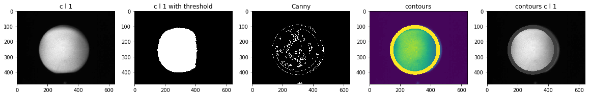
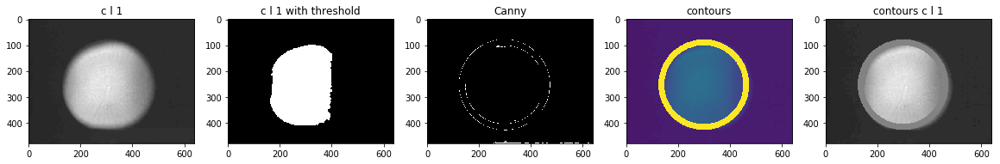
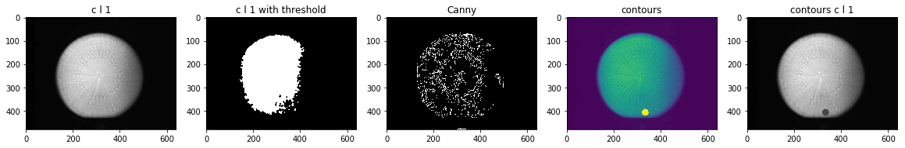

```python
# find the outlines
# draw a white circle arounds it
from matplotlib.pyplot import imshow
import numpy as np
from PIL import Image
from PIL import Image
import cv2
import matplotlib.pyplot as plt
import numpy as np
import sys 
import random    
import glob
%matplotlib inline 
```


```python
# find the outlines
# draw a white circle arounds it

import cv2
import numpy as np
from matplotlib.pyplot import imshow
import matplotlib.pyplot as plt

path = r'S:\QA\Magic Mirror data\30micron OKMETIC nozzle-6 inches'
files = glob.glob(path + "/**/*.jpg", recursive=True)

kernel = cv2.getStructuringElement(cv2.MORPH_CROSS,(3,3))

for i in range(100):
    plt.figure(figsize=(20,10)) 
    name1 = files[random.randint(0, len(files)-1)]
    img = cv2.imread(name1, 0)  
    img1 = cv2.imread(name1, 0)  
#     img = cv2.bitwise_not(img)
#     img = cv2.adaptiveThreshold(img,255,cv2.ADAPTIVE_THRESH_MEAN_C,\
#              cv2.THRESH_BINARY,11,2)
    
#     dilation = cv2.dilate(img,kernel,iterations = 4)
# #     erosion = cv2.erode(dilation,kernel,iterations = 4)
#     img = dilation
#     img = cv2.bitwise_not(img)
#     img1 = cv2.bitwise_not(img1)
    quartiles = np.percentile(img, range(0, 100, 10), interpolation = 'midpoint')
    print(quartiles)
# img = cv2.imread(r'S:\QA\Magic Mirror data\50 micron okmetic 6-inch nozzle\458781-0 (lot 447195-1)\3902833056.jpg', 0)
# img = cv2.adaptiveThreshold(img,255,cv2.ADAPTIVE_THRESH_MEAN_C,\
#             cv2.THRESH_BINARY,11,2)
#     kernel = cv2.getStructuringElement(cv2.MORPH_CROSS,(3,3))
#     img = cv2.morphologyEx(img, cv2.MORPH_OPEN, kernel) 
#     quartiles = np.percentile(img, range(0, 100, 10), interpolation = 'midpoint')
#     print(quartiles)

    clahe = cv2.createCLAHE(clipLimit=0.05, tileGridSize=(8,8))
    cl1 = clahe.apply(img)
    
    quartiles = np.percentile(cl1, range(0, 100, 10), interpolation = 'midpoint')
    print(quartiles)
    plt.subplot(1,5,1), plt.imshow(cl1, cmap='gray'), plt.title("c l 1") 
    
#     ret,cl1 = cv2.threshold(cl1,quartiles[-3],255,cv2.THRESH_TOZERO)
    ret,cl1 = cv2.threshold(cl1,quartiles[-2],255,cv2.THRESH_BINARY)
#     cl1 = cv2.adaptiveThreshold(cl1,0,cv2.ADAPTIVE_THRESH_MEAN_C,\
#             cv2.THRESH_BINARY,11,2)
    dilation = cv2.dilate(cl1,kernel,iterations = 4)
    erosion = cv2.erode(dilation,kernel,iterations = 3)
    cl1 = erosion
    dilation = cv2.dilate(cl1,kernel,iterations = 4)
    erosion = cv2.erode(dilation,kernel,iterations = 3)
    cl1 = erosion
    
    quartiles = np.percentile(cl1, range(0, 100, 10), interpolation = 'midpoint')
    print(quartiles)
    plt.subplot(1,5,2), plt.imshow(cl1, cmap='gray') , plt.title("c l 1 with threshold")
    
#     ret,thresh = cv2.threshold(img1,11,255,1)
    contours,hierarchy = cv2.findContours(cl1, 0 , 2 ) 
    cnt = contours[0]
    M = cv2.moments(cnt)
    print(M)
    (x,y),radius = cv2.minEnclosingCircle(cnt)
    center = (int(x),int(y))
    radius = int(radius)
    con = cv2.circle(img,center,radius, 255, 22)
    print(center, radius, "ordinary")
    plt.subplot(1,5,4), plt.imshow(con ), plt.title("contours")
    
    ret,thresh = cv2.threshold(cl1,11,255,3)
    contours1,hierarchy = cv2.findContours(cl1, 0 , 2 ) 
    cnt1 = contours1[0]
    M = cv2.moments(cnt1)
    print(M)
    (x,y),radius = cv2.minEnclosingCircle(cnt1)
    center = (int(x),int(y))
    radius = int(radius)
    con1 = cv2.circle(img,center,radius, 55, 22)
    print(center, radius, "cl1-ed")
    plt.subplot(1,5,5), plt.imshow(con1, cmap='gray' ), plt.title("contours c l 1")

    edged = cv2.Canny(img, 11, 60)
    plt.subplot(1,5,3), plt.imshow(edged, cmap='gray'), plt.title("Canny")
    plt.show() 
    if input("Press Enter to continue...") == "0":
        break

```

    [  0.  48.  50.  50.  50.  50.  50.  70. 104. 118.]
    [  1.  50.  52.  52.  52.  52.  52.  72. 105. 119.]
    [  0.   0.   0.   0.   0.   0.   0.   0. 255. 255.]
    {'m00': 127.5, 'm10': 53641.0, 'm01': 40317.33333333333, 'm20': 22569975.75, 'm11': 16962395.541666664, 'm02': 12749668.75, 'm30': 9497576682.6, 'm21': 7137236935.316667, 'm12': 5364175947.783333, 'm03': 4032101864.7000003, 'mu20': 2470.8009803928435, 'mu11': 340.03316993266344, 'mu02': 748.2236383482814, 'mu30': -899.1766929626465, 'mu21': -45.675776648451574, 'mu12': 262.44950318249175, 'mu03': 79.23330545425415, 'nu20': 0.15199083308837175, 'nu11': 0.02091707312157868, 'nu02': 0.046026828964138795, 'nu30': -0.004898572942827746, 'nu21': -0.000248834434192839, 'nu12': 0.0014297835399985684, 'nu03': 0.00043165056357298077}
    (420, 317) 9 ordinary
    {'m00': 127.5, 'm10': 53641.0, 'm01': 40317.33333333333, 'm20': 22569975.75, 'm11': 16962395.541666664, 'm02': 12749668.75, 'm30': 9497576682.6, 'm21': 7137236935.316667, 'm12': 5364175947.783333, 'm03': 4032101864.7000003, 'mu20': 2470.8009803928435, 'mu11': 340.03316993266344, 'mu02': 748.2236383482814, 'mu30': -899.1766929626465, 'mu21': -45.675776648451574, 'mu12': 262.44950318249175, 'mu03': 79.23330545425415, 'nu20': 0.15199083308837175, 'nu11': 0.02091707312157868, 'nu02': 0.046026828964138795, 'nu30': -0.004898572942827746, 'nu21': -0.000248834434192839, 'nu12': 0.0014297835399985684, 'nu03': 0.00043165056357298077}
    (420, 317) 9 cl1-ed
    


    Press Enter to continue...
    [  0.   0.   0.   0.   0.   0.   0.  90. 122. 136.]
    [  1.   1.   1.   1.   1.   1.   1.  93. 125. 139.]
    [  0.   0.   0.   0.   0.   0.   0.   0. 255. 255.]
    {'m00': 12.0, 'm10': 3348.0, 'm01': 4902.0, 'm20': 934102.6666666666, 'm11': 1367658.0, 'm02': 2002480.0, 'm30': 260620596.0, 'm21': 381580939.3333333, 'm12': 558691920.0, 'm03': 818023701.0, 'mu20': 10.666666666627862, 'mu11': 0.0, 'mu02': 13.0, 'mu30': 2.9802322387695312e-08, 'mu21': -4.016328603029251e-09, 'mu12': 0.0, 'mu03': 0.0, 'nu20': 0.07407407407380459, 'nu11': 0.0, 'nu02': 0.09027777777777778, 'nu30': 5.974437101740242e-11, 'nu21': -8.051487500392124e-12, 'nu12': 0.0, 'nu03': 0.0}
    (279, 408) 2 ordinary
    {'m00': 12.0, 'm10': 3348.0, 'm01': 4902.0, 'm20': 934102.6666666666, 'm11': 1367658.0, 'm02': 2002480.0, 'm30': 260620596.0, 'm21': 381580939.3333333, 'm12': 558691920.0, 'm03': 818023701.0, 'mu20': 10.666666666627862, 'mu11': 0.0, 'mu02': 13.0, 'mu30': 2.9802322387695312e-08, 'mu21': -4.016328603029251e-09, 'mu12': 0.0, 'mu03': 0.0, 'nu20': 0.07407407407380459, 'nu11': 0.0, 'nu02': 0.09027777777777778, 'nu30': 5.974437101740242e-11, 'nu21': -8.051487500392124e-12, 'nu12': 0.0, 'nu03': 0.0}
    (279, 408) 2 cl1-ed
    





    Press Enter to continue...
    [ 0.  4.  4.  4.  4.  6.  6. 44. 68. 77.]
    [ 1.  5.  5.  5.  5.  7.  7. 47. 71. 80.]
    [  0.   0.   0.   0.   0.   0.   0.   0. 255. 255.]
    {'m00': 8.0, 'm10': 1536.0, 'm01': 2552.0, 'm20': 294917.3333333333, 'm11': 489984.0, 'm02': 814093.3333333333, 'm30': 56626176.0, 'm21': 94078629.33333333, 'm12': 156305920.0, 'm03': 259699176.0, 'mu20': 5.333333333313931, 'mu11': 0.0, 'mu02': 5.333333333255723, 'mu30': 1.4901161193847656e-08, 'mu21': 1.2223608791828156e-09, 'mu12': 1.4901161193847656e-08, 'mu03': 5.960464477539063e-08, 'nu20': 0.08333333333303017, 'nu11': 0.0, 'nu02': 0.08333333333212067, 'nu30': 8.231806349783991e-11, 'nu21': 6.75265364630718e-12, 'nu12': 8.231806349783991e-11, 'nu03': 3.2927225399135965e-10}
    (192, 319) 2 ordinary
    {'m00': 8.0, 'm10': 1536.0, 'm01': 2552.0, 'm20': 294917.3333333333, 'm11': 489984.0, 'm02': 814093.3333333333, 'm30': 56626176.0, 'm21': 94078629.33333333, 'm12': 156305920.0, 'm03': 259699176.0, 'mu20': 5.333333333313931, 'mu11': 0.0, 'mu02': 5.333333333255723, 'mu30': 1.4901161193847656e-08, 'mu21': 1.2223608791828156e-09, 'mu12': 1.4901161193847656e-08, 'mu03': 5.960464477539063e-08, 'nu20': 0.08333333333303017, 'nu11': 0.0, 'nu02': 0.08333333333212067, 'nu30': 8.231806349783991e-11, 'nu21': 6.75265364630718e-12, 'nu12': 8.231806349783991e-11, 'nu03': 3.2927225399135965e-10}
    (192, 319) 2 cl1-ed
    





    Press Enter to continue...
    [  0.   2.   2.   4.   4.   4.   4.   6. 126. 183.]
    [  1.   3.   3.   5.   5.   5.   5.   7. 128. 185.]
    [  0.   0.   0.   0.   0.   0.   0.   0. 255. 255.]
    {'m00': 62892.5, 'm10': 17863979.666666664, 'm01': 16300371.666666666, 'm20': 5352032241.916666, 'm11': 4634862078.791666, 'm02': 4588076469.916666, 'm30': 1676949308204.6, 'm21': 1390458755108.55, 'm12': 1307861845529.7832, 'm03': 1376908020452.4001, 'mu20': 277949171.1040888, 'mu11': 4906074.300785065, 'mu02': 363373739.52004623, 'mu30': -1138728157.1967773, 'mu21': 541058430.4142303, 'mu12': 2121949091.3009338, 'mu03': -579052106.2702637, 'nu20': 0.07026962992896592, 'nu11': 0.0012403275899357605, 'nu02': 0.09186621460517277, 'nu30': -0.0011479498441893526, 'nu21': 0.0005454400481501585, 'nu12': 0.002139133131416643, 'nu03': -0.0005837414056808983}
    (295, 259) 152 ordinary
    {'m00': 62892.5, 'm10': 17863979.666666664, 'm01': 16300371.666666666, 'm20': 5352032241.916666, 'm11': 4634862078.791666, 'm02': 4588076469.916666, 'm30': 1676949308204.6, 'm21': 1390458755108.55, 'm12': 1307861845529.7832, 'm03': 1376908020452.4001, 'mu20': 277949171.1040888, 'mu11': 4906074.300785065, 'mu02': 363373739.52004623, 'mu30': -1138728157.1967773, 'mu21': 541058430.4142303, 'mu12': 2121949091.3009338, 'mu03': -579052106.2702637, 'nu20': 0.07026962992896592, 'nu11': 0.0012403275899357605, 'nu02': 0.09186621460517277, 'nu30': -0.0011479498441893526, 'nu21': 0.0005454400481501585, 'nu12': 0.002139133131416643, 'nu03': -0.0005837414056808983}
    (295, 259) 152 cl1-ed
    





```python

```


```python
# find the outlines
# draw a white circle arounds it

import cv2
import numpy as np
from matplotlib.pyplot import imshow
import matplotlib.pyplot as plt

path = r'S:\QA\Magic Mirror data\30micron OKMETIC nozzle-6 inches'
files = glob.glob(path + "/**/*.jpg", recursive=True)

kernel = cv2.getStructuringElement(cv2.MORPH_CROSS,(3,3))

for i in range(100):
    plt.figure(figsize=(20,10)) 
    name1 = files[random.randint(0, len(files)-1)]
    img = cv2.imread(name1, 0)  
    img1 = cv2.imread(name1, 0)  
#     img = cv2.bitwise_not(img)
#     img = cv2.adaptiveThreshold(img,255,cv2.ADAPTIVE_THRESH_MEAN_C,\
#              cv2.THRESH_BINARY,11,2)
    
#     dilation = cv2.dilate(img,kernel,iterations = 4)
# #     erosion = cv2.erode(dilation,kernel,iterations = 4)
#     img = dilation
#     img = cv2.bitwise_not(img)
#     img1 = cv2.bitwise_not(img1)
    quartiles = np.percentile(img, range(0, 100, 10), interpolation = 'midpoint')
    print(quartiles)
# img = cv2.imread(r'S:\QA\Magic Mirror data\50 micron okmetic 6-inch nozzle\458781-0 (lot 447195-1)\3902833056.jpg', 0)
# img = cv2.adaptiveThreshold(img,255,cv2.ADAPTIVE_THRESH_MEAN_C,\
#             cv2.THRESH_BINARY,11,2)
#     kernel = cv2.getStructuringElement(cv2.MORPH_CROSS,(3,3))
#     img = cv2.morphologyEx(img, cv2.MORPH_OPEN, kernel) 
#     quartiles = np.percentile(img, range(0, 100, 10), interpolation = 'midpoint')
#     print(quartiles)

    clahe = cv2.createCLAHE(clipLimit=0.05, tileGridSize=(8,8))
    cl1 = clahe.apply(img)
    
    quartiles = np.percentile(cl1, range(0, 100, 10), interpolation = 'midpoint')
    print(quartiles)
    plt.subplot(1,5,1), plt.imshow(cl1, cmap='gray'), plt.title("c l 1") 
    
#     ret,cl1 = cv2.threshold(cl1,quartiles[-3],255,cv2.THRESH_TOZERO)
    ret,cl1 = cv2.threshold(cl1,quartiles[-2],255,cv2.THRESH_BINARY)
#     cl1 = cv2.adaptiveThreshold(cl1,0,cv2.ADAPTIVE_THRESH_MEAN_C,\
#             cv2.THRESH_BINARY,11,2)
    dilation = cv2.dilate(cl1,kernel,iterations = 4)
    erosion = cv2.erode(dilation,kernel,iterations = 3)
    cl1 = erosion
    dilation = cv2.dilate(cl1,kernel,iterations = 4)
    erosion = cv2.erode(dilation,kernel,iterations = 3)
    cl1 = erosion
    
    quartiles = np.percentile(cl1, range(0, 100, 10), interpolation = 'midpoint')
    print(quartiles)
    plt.subplot(1,5,2), plt.imshow(cl1, cmap='gray') , plt.title("c l 1 with threshold")
    
#     ret,thresh = cv2.threshold(img1,11,255,1)
    contours,hierarchy = cv2.findContours(cl1, 0 , 2 ) 
    cnt = contours[0]
    M = cv2.moments(cnt)
    print(M)
    (x,y),radius = cv2.minEnclosingCircle(cnt)
    center = (int(x),int(y))
    radius = int(radius)
    con = cv2.circle(img,center,radius, 255, 22)
    print(center, radius, "ordinary")
    plt.subplot(1,5,4), plt.imshow(con ), plt.title("contours")
    
    ret,thresh = cv2.threshold(cl1,11,255,3)
    contours1,hierarchy = cv2.findContours(cl1, 0 , 2 ) 
    cnt1 = contours1[0]
    M = cv2.moments(cnt1)
    print(M)
    (x,y),radius = cv2.minEnclosingCircle(cnt1)
    center = (int(x),int(y))
    radius = int(radius)
    con1 = cv2.circle(img,center,radius, 55, 22)
    print(center, radius, "cl1-ed")
    plt.subplot(1,5,5), plt.imshow(con1, cmap='gray' ), plt.title("contours c l 1")

    edged = cv2.Canny(img, 11, 60)
    plt.subplot(1,5,3), plt.imshow(edged, cmap='gray'), plt.title("Canny")
    plt.show() 
    if input("Press Enter to continue...") == "0":
        break

```


```python
import cv2
import numpy as np
from matplotlib.pyplot import imshow
import matplotlib.pyplot as plt

img = cv2.imread(r'R:\Personal Folders\Jiacheng Qu\4_white_spots\sample_wafer.jpg', 0)
# img = cv2.adaptiveThreshold(img,255,cv2.ADAPTIVE_THRESH_MEAN_C,\
#             cv2.THRESH_BINARY,11,2)
kernel = cv2.getStructuringElement(cv2.MORPH_CROSS,(3,3))
# img = cv2.morphologyEx(img, cv2.MORPH_OPEN, kernel) 
# img = cv2.morphologyEx(img, cv2.MORPH_OPEN, kernel) 
img = cv2.morphologyEx(img, cv2.MORPH_CLOSE, kernel) 
# img = cv2.morphologyEx(img, cv2.MORPH_CLOSE, kernel) 


kernel = cv2.getStructuringElement(cv2.MORPH_CROSS,(3,3))
img = cv2.erode(img,kernel,iterations = 3)
img = cv2.dilate(img,kernel,iterations = 4)
clahe = cv2.createCLAHE(clipLimit=2.0, tileGridSize=(8,8))
cl1 = clahe.apply(img)
# normalizedImg = np.zeros((480, 640))
# img = cv2.normalize(img, normalizedImg, 0, 255, cv2.NORM_MINMAX)

quartiles = np.percentile(img, range(0, 100, 10), interpolation = 'midpoint')
print(quartiles)
  

 
print(M)
(x,y),radius = cv2.minEnclosingCircle(cnt)
center = (int(x),int(y))
radius = int(radius)
con = cv2.circle(img,center,radius, 255, 5)
print(center, radius)
# plt.imshow(con)
plt.imshow(img)
plt.show() 


plt.imshow(cl1)
plt.show() 

edged = cv2.Canny(cl1, 90, 180)
plt.imshow(edged)
plt.show() 
```


```python

# img = cv2.imread(r'S:\QA\Magic Mirror data\30micron OKMETIC nozzle-6 inches\451164-1\4384767192.jpg', 0) 
# # img = cv2.adaptiveThreshold(img,255,cv2.ADAPTIVE_THRESH_MEAN_C,\
# #             cv2.THRESH_BINARY,11,2)

# quartiles = np.percentile(img, range(0, 100, 10), interpolation = 'midpoint')
# print(quartiles)
# ret,thresh = cv2.threshold(img,33,255,3)
# contours,hierarchy = cv2.findContours(thresh, 0 , 2 )
# perimeter = cv2.arcLength(cnt,True)
# cnt = contours[0]
# M = cv2.moments(cnt)


# print(M)
# (x,y),radius = cv2.minEnclosingCircle(cnt)
# center = (int(x),int(y))
# radius = int(radius)
# con = cv2.circle(img,center,radius, 255, 5)
# print(center)
# # plt.imshow(con)
# plt.imshow(con, cmap='gray')

```
